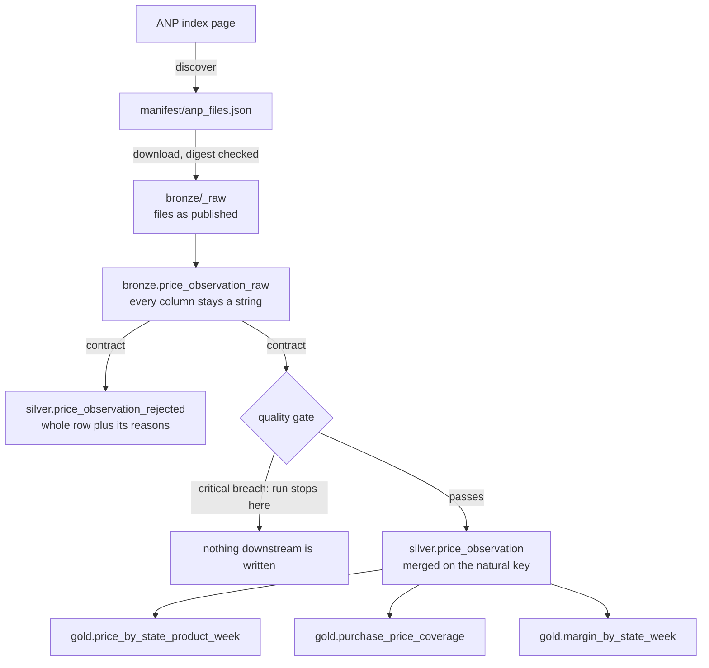
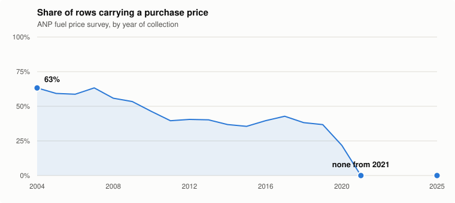

# fuel-price-lakehouse

[](https://github.com/gnycholas/fuel-price-lakehouse/actions/workflows/ci.yml)

A bronze/silver/gold pipeline over Brazil's national fuel price survey, built
with PySpark and Delta Lake. Twenty years of weekly price collection from petrol
stations across the country, 27.8 million rows.

What it is really about: the quality checks stop the run instead of logging a
warning, and rows that fail the contract go to a quarantine table rather than
disappearing.

## Running it

```bash
docker compose up -d                                   # MinIO, buckets included
make install
make pipeline                                          # discover, download, bronze, silver, gold
```

No cloud account needed. Storage is MinIO behind `s3a://` paths, so the code has
no local mode branch. A smaller slice, if you would rather not pull the lot:

```bash
.venv/bin/python -m fuel_lakehouse.cli download --year 2025 --group glp
.venv/bin/python -m fuel_lakehouse.cli bronze --year 2025
.venv/bin/python -m fuel_lakehouse.cli silver --year 2025
.venv/bin/python -m fuel_lakehouse.cli gold
```

## Shape



The gate sits before the merge rather than after it, so a breach keeps bad rows
out of silver altogether instead of publishing them and holding gold back.

Four things hold on every run, and each has a test that breaks them on purpose:

- `count(bronze) == count(accepted) + count(rejected)`
- `(reseller_cnpj, product, collection_date)` is unique in silver
- rerunning a window changes nothing, content included, not just the row count
- a critical rule breach stops the run before gold is touched

The second one is there because it broke. The key is unique in every file I
sampled while building this, and it is not unique across the whole series: one
2005 file repeats 36 keys. The gate caught it on the first full load, before the
merge could pick among them and leave silver quietly wrong.

## What is awkward about this data

The interesting part of this dataset is not its size. The schema has been
byte-identical since 2004, so there is no drift to absorb. What it has instead
is a set of traps that produce wrong numbers without producing errors.

### The purchase price column stops being filled

<picture>
  <source media="(prefers-color-scheme: dark)" srcset="docs/img/purchase-price-coverage-dark.svg">
  
</picture>

The column is declared for the whole series and stops being filled partway
through: 63% of rows carry a purchase price in 2004, 41% in 2012, and none at
all in 2021 or 2025. Any margin metric built on top of it quietly stops meaning
anything, and nothing in the pipeline notices unless somebody makes it notice.

So `gold.margin_by_state_week` always carries `coverage_ratio` and `is_reliable`
next to the number, and a week with no purchase price produces no row rather
than a zero margin. A zero would drag every average down while looking like
data.

### Prices come in units that cannot be averaged together

| Product | Unit |
|---|---|
| GASOLINA, GASOLINA ADITIVADA, ETANOL, DIESEL, DIESEL S10, DIESEL S50 | `R$ / litro` |
| GNV | `R$ / m³` |
| GLP | `R$ / 13 kg` |

A `GROUP BY state, product` mixes litres of petrol with 13 kg cylinders of LPG.
The result is arithmetically meaningless and looks perfectly normal. The unit is
therefore part of the gold grain, not a descriptive column, which makes that
query impossible to write by accident.

### The published filenames follow no pattern

2026 alone has four shapes. One of them carries a typo from the publisher:

```
01-dados-abertos-precos-gasolina-etanol.csv
02-cados-abertos-preco-gasolina-etanol.csv          <- cados, and preco singular
03-dados-abertos-precos-gasolina-etanol.csv
05-dados-abertos-precos-gasolina-etanol.csv         <- April is not published
06-dados-abertos-precos-2026-06-gasolina-etanol.csv <- year and month in the middle
```

Add a ZIP among the CSVs for one 2022 semester, a whole year missing between the
old semiannual series and the current monthly one, and three naming schemes in
the LPG files. Building URLs from a template loses February 2026 to a typo,
silently. Files are discovered from the index page instead, into a versioned
manifest, and anything unrecognized is recorded rather than skipped.

### One file in the series is latin-1

`ca-2021-02.csv` is latin-1. `ca-2021-01.csv`, the other half of the same year,
is UTF-8 with a byte order mark. Read the first one as UTF-8 and nothing fails:
every accented character in it comes out mangled, municipality and reseller
names included, and the damage surfaces much later as groupings that do not
match. The charset is detected at download time and travels with the rows as
`_source_encoding`.

### Quoting is not optional

966 rows of the 2004 file contain a semicolon inside a quoted field. Split on
the delimiter without honouring quotes and every column after it shifts, which
reads as a postcode sitting in the product column. That is exactly the count of
rows a naive split gets wrong, and none of them raise anything.

## A run over the whole series

```
27822176 in bronze, 27822013 accepted, 163 rejected
[ok] natural_key_unique:      0 duplicated
[ok] one_unit_per_product:    none
[ok] layer_reconciliation:    27822176 accounted, 27822176 in source
[ok] rejection_rate:          0.000006, expected [0, 0.001]
[--] purchase_price_coverage: 0.436650
```

Gold comes out at 136,878 weekly price cells, 2,823 coverage rows and 112,125
margin rows. Of the 163 quarantined rows, 162 are the repeated keys from that
one 2005 file.

### The gate has failed twice, and was right both times

**Against a five million row slice, 53,038 rows were rejected**, 1.05% against a
threshold guessed at 1%. Not one of them was bad data. `DIESEL S50` was missing
from the product list, because sampling 2004 and 2025 skipped the years it
existed, and `R$ / m³` was arriving as `R$ / m?` from the one latin-1 file being
read as UTF-8. A threshold picked in advance is how a gate ends up rejecting
good data for a year while everyone concludes the publisher ships rubbish.

**Against the full 27.8 million, the uniqueness of the natural key failed.** It
holds in every file I sampled and does not hold across the series. That check
existed only because a measurement on two files is not a proof, and it earned
its place: without it the merge would have picked among the repeated rows and
left silver quietly wrong.

Thresholds come from measured distributions, with the numbers beside them in the
code. The rejection rate allows 0.1%. A weekly cell is thin below ten
observations, the bottom 7% of 136,878 cells whose median is 89. A margin counts
as reliable above 50% coverage, against an observed median of 43%.

## Layout

```
src/fuel_lakehouse/
  sources/      discovery, manifest, download with digest checks
  bronze/       load as published, all strings, lineage stamped
  silver/       contract, quarantine, reconciliation, merge
  gold/         weekly prices, coverage, margin
  dq/           rules.yaml and the engine that runs them
tests/          fixtures cut from the real published files
scripts/        chart generation for this page
```

## Tests

Transformations are functions from DataFrame to DataFrame, so most of the suite
runs without touching object storage. Fixtures are cut from the real files
rather than invented, keeping the byte order mark, CRLF endings, the quoted
semicolon and a latin-1 sample: made-up fixtures do not reproduce what real data
does.

```bash
make check      # format, lint, types, tests
```

## Decisions

Written up in [docs/decisions.md](docs/decisions.md), with what each one costs.

## Source

[Série Histórica de Preços de Combustíveis](https://www.gov.br/anp/pt-br/centrais-de-conteudo/dados-abertos/serie-historica-de-precos-de-combustiveis),
published as open data by ANP, Brazil's petroleum and fuel regulator. It surveys
petrol stations across the country and publishes what each one charged, by
product and week.

Code is MIT licensed. The data belongs to ANP and keeps its own terms.
